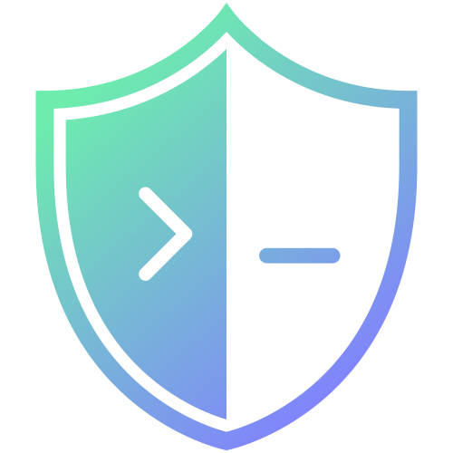

<div align="center">
  
  <h1>IronShell</h1>
</div>

> A premium, web-based SSH terminal with ZSH aesthetics and Cloudflare Access support.


IronShell is a modern web terminal designed for those who love the look and feel of a customized ZSH shell but need the flexibility of a web client. It features a stunning glassmorphism UI, robust terminal emulation, and built-in support for connecting to servers behind Cloudflare Access.


## ✨ Features

- **🎨 Premium Aesthetics**: Dracula-inspired theme, Fira Code fonts, and glassmorphism UI.
- **⚡ Real-time Emulation**: Powered by `xterm.js` and `socket.io` for a lag-free experience.
- **☁️ Cloudflare Access Ready**: Automatically detects and tunnels connections via `cloudflared` for Zero Trust environments.
- **🖥️ Responsive Design**: Resizes perfectly with your browser window.
- **🔒 Secure**: Handles SSH connections securely via the backend.

## 🚀 Getting Started

### Prerequisites

- Node.js (v18+)
- `cloudflared` (if connecting to Cloudflare Access protected hosts)

### Installation

1.  **Clone the repository**
    ```bash
    git clone https://github.com/yourusername/ironshell.git
    cd ironshell
    ```

2.  **Install Backend Dependencies**
    ```bash
    cd server
    npm install
    ```

3.  **Install Frontend Dependencies**
    ```bash
    cd ../client
    npm install
    ```

### Docker (Recommended)

1.  **Start with Docker Compose**
    ```bash
    docker-compose up --build
    ```

2.  Open `http://localhost:10000`

### Manual Setup

1.  **Start the Backend** (Port 50000)
    ```bash
    cd server
    npm start
    ```

2.  **Start the Frontend** (Port 10000)
    ```bash
    cd client
    npm run dev
    ```

3.  Open your browser to `http://localhost:10000` and connect!

## 🛠️ Tech Stack

- **Frontend**: React, Vite, xterm.js
- **Backend**: Node.js, Express, ssh2, socket.io
- **Tunneling**: Cloudflare Tunnel (`cloudflared`)

## 📝 License

This project is licensed under the MIT License.
